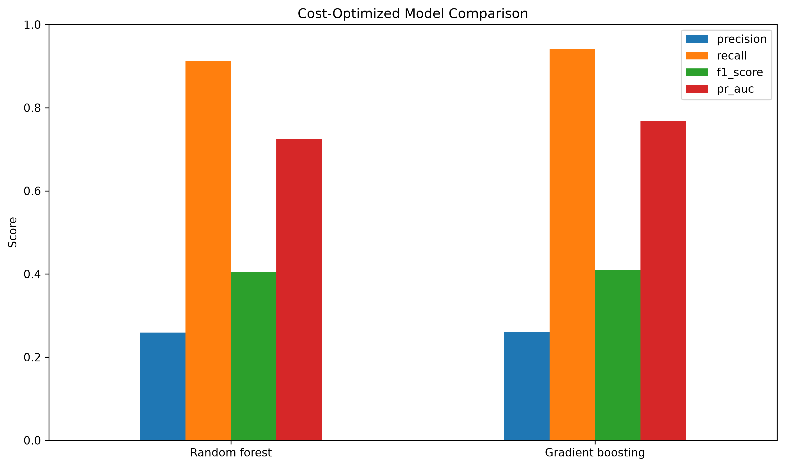
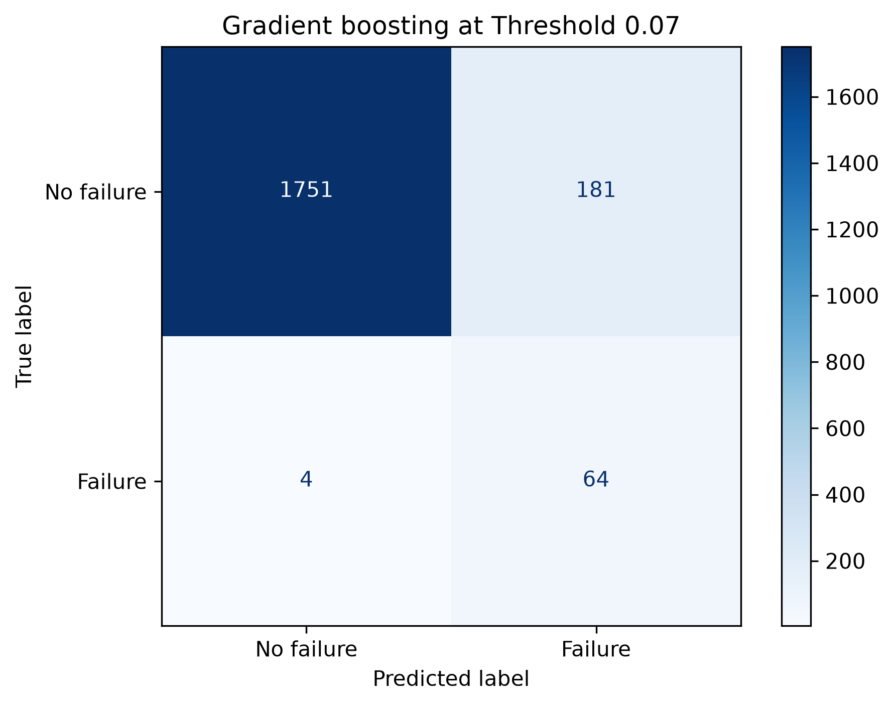

# Predictive Maintenance – AI4I 2020

> An end-to-end machine-learning project for detecting machine failure conditions from industrial sensor data.


## Overview

This project develops a reproducible predictive-maintenance classification
pipeline using the AI4I 2020 dataset.

The objective is to detect machine failure conditions from operational
measurements while accounting for the strong class imbalance and the different
business consequences of false alarms and missed failures.

The project covers:

- exploratory data analysis and leakage prevention
- preprocessing of numerical and categorical features
- dummy and logistic-regression baselines
- random forest and histogram gradient boosting
- stratified five-fold cross-validation
- cost-based decision-threshold optimization
- final model selection on validation data
- evaluation on an untouched test set
- model persistence and command-line inference
- automated tests and code-quality checks

## Final result

Gradient boosting was selected as the final model based on the estimated
validation cost. Its decision threshold was reduced from the default value of
`0.50` to `0.07` because a missed failure was assumed to be substantially more
expensive than an unnecessary maintenance inspection.

| Metric | Final test result |
|---|---:|
| Accuracy | 90.75% |
| Precision | 26.12% |
| Recall | 94.12% |
| F1-score | 40.89% |
| PR-AUC | 76.90% |
| True positives | 64 |
| False negatives | 4 |
| False positives | 181 |
| True negatives | 1,751 |

The final model detects **64 of 68 failures** in the untouched test set.

The lower threshold increases the number of false alarms, but it reduces the
number of missed failures to four. This trade-off is intentional and follows the
defined maintenance-cost assumptions.

## Cost assumptions

The threshold optimization uses the following illustrative costs:

| Event | Assumed cost |
|---|---:|
| False maintenance alarm | EUR 100 |
| Missed machine failure | EUR 5,000 |

The estimated test-set cost is therefore:

```text
181 false alarms × EUR 100
+ 4 missed failures × EUR 5,000
= EUR 38,100
```

These values are project assumptions. In an industrial application, they would
need to be determined together with maintenance, production, and controlling
experts.

## Results

### Cost-optimized model comparison



Logistic regression initially achieved high recall but generated many false
alarms. Random forest produced more reliable alarms but missed a larger number
of failures. Gradient boosting provided the strongest overall balance during
cross-validation.

After separate threshold optimization, gradient boosting was selected using
validation data. The test set was kept separate from model and threshold
selection.

### Final confusion matrix



At the optimized threshold of `0.07`, the final model produces:

- 64 correctly detected failures
- 4 missed failures
- 181 false maintenance alarms
- 1,751 correctly classified normal observations

## Dataset

The project uses the
[AI4I 2020 Predictive Maintenance Dataset](https://archive.ics.uci.edu/ml/datasets/AI4I%2B2020%2BPredictive%2BMaintenance%2BDataset)
from the UCI Machine Learning Repository.

The dataset contains 10,000 synthetic observations designed to reflect
industrial predictive-maintenance data. The binary target is
`Machine failure`.

Model features:

| Feature | Description |
|---|---|
| Type | Product quality category: L, M, or H |
| Air temperature | Air temperature in Kelvin |
| Process temperature | Process temperature in Kelvin |
| Rotational speed | Rotational speed in rpm |
| Torque | Torque in Nm |
| Tool wear | Tool wear in minutes |

Identifiers and failure-type indicators are excluded from model training.
In particular, `TWF`, `HDF`, `PWF`, `OSF`, and `RNF` are removed because they
directly describe failure modes and would cause target leakage.

The raw dataset is not committed to the repository. It is downloaded
automatically when the training pipeline is run for the first time.

## Methodology

### Data splitting

The data is divided using stratified sampling:

- 60% training data
- 20% validation data
- 20% final test data

The validation set is used to choose the decision threshold. The test set is
used only for the final evaluation.

### Models

The following models are investigated:

1. Dummy classifier
2. Class-weighted logistic regression
3. Class-weighted random forest
4. Class-weighted histogram gradient boosting

The models are compared using precision, recall, F1-score, and PR-AUC.
PR-AUC is emphasized because machine failures account for only a small
proportion of all observations.

### Cross-validation

Stratified five-fold cross-validation is applied to the training data. This
checks whether model performance remains stable across different subsets rather
than depending on one favorable train-test split.

### Threshold optimization

The default classification threshold of `0.50` is not assumed to be optimal.
Candidate thresholds are evaluated using:

```text
total cost =
false positives × false-positive cost
+ false negatives × false-negative cost
```

This connects the statistical model to an operational maintenance decision.

## Project structure

```text
predictive-maintenance-ai4i/
├── data/
│   ├── processed/
│   └── raw/
├── models/
├── notebooks/
│   ├── 01_data_exploration.ipynb
│   ├── 02_preprocessing.ipynb
│   ├── 03_baseline_models.ipynb
│   ├── 04_random_forest.ipynb
│   ├── 05_threshold_optimization.ipynb
│   ├── 06_cross_validation.ipynb
│   └── 07_final_model_selection.ipynb
├── reports/
│   ├── figures/
│   │   ├── cost_optimized_model_comparison.png
│   │   └── final_confusion_matrix.png
│   └── final_metrics.json
├── src/
│   └── predictive_maintenance/
│       ├── __init__.py
│       ├── data.py
│       ├── evaluate.py
│       ├── features.py
│       ├── predict.py
│       ├── train.py
│       └── train_final.py
├── tests/
│   ├── test_evaluate.py
│   ├── test_features.py
│   └── test_predict.py
├── .gitignore
├── LICENSE
├── pyproject.toml
└── README.md
```

## Installation

Clone the repository and enter the project directory:

```bash
git clone https://github.com/AlexKoro186/predictive-maintenance-ai4i.git
cd predictive-maintenance-ai4i
```

Create and activate a virtual environment:

```bash
python3 -m venv .venv
source .venv/bin/activate
```

Upgrade pip and install the project with its development dependencies:

```bash
python -m pip install --upgrade pip
python -m pip install ".[dev]"
```

The project requires Python 3.11 or newer.

## Train the final model

Run the complete final training pipeline from the repository root:

```bash
python -m predictive_maintenance.train_final
```

The command:

1. loads or downloads the dataset
2. creates the model features
3. creates training, validation, and test splits
4. trains the gradient-boosting model
5. determines the cost-optimal threshold
6. evaluates the model on the test set
7. saves the model locally
8. writes the final metrics report

Generated files:

```text
models/failure_predictor.joblib
reports/final_metrics.json
```

The binary model file is intentionally excluded from version control because it
can be regenerated from the source code.

## Generate a prediction

After training, a prediction can be generated from the command line:

```bash
python -m predictive_maintenance.predict \
  --type L \
  --air-temperature 300.0 \
  --process-temperature 310.0 \
  --rotational-speed 1300 \
  --torque 60 \
  --tool-wear 200
```

Example output:

```text
Failure probability: 98.24%
Decision threshold: 0.07
Maintenance alert: Yes
```

The output contains:

- the predicted probability of machine failure
- the selected decision threshold
- the resulting maintenance decision

## Run the notebooks

Start JupyterLab:

```bash
jupyter lab
```

The notebooks are numbered in the intended execution order. Each notebook
documents one stage of the machine-learning workflow.

## Tests and code quality

Run the automated tests:

```bash
python -m pytest
```

Run the Ruff code-quality check:

```bash
python -m ruff check src tests
```

Apply safe automatic Ruff fixes:

```bash
python -m ruff check src tests --fix
```

## Limitations

- The dataset is synthetic and cannot replace validation with real production
  data.
- The target describes a failure condition for the current observation. The
  project does not forecast remaining useful life or a future failure time.
- The cost assumptions are illustrative and not derived from a real factory.
- The optimized threshold is specific to the dataset, model, and assumed costs.
- The model should not be deployed in a safety-critical environment without
  calibration, monitoring, domain validation, and human oversight.
- Potential distribution shifts in machines, sensors, and operating conditions
  are not represented by the current evaluation.

## Possible extensions

- probability calibration
- hyperparameter optimization
- SHAP-based model explanations
- model and data drift monitoring
- time-dependent failure prediction
- remaining-useful-life estimation
- API or Streamlit interface
- validation with real industrial sensor data

## Reproducibility

All random data splits and supported estimators use `random_state=42`. Model
selection and threshold optimization are separated from the final test
evaluation.

The detailed final results are stored in
[`reports/final_metrics.json`](reports/final_metrics.json).

## Citation

```text
AI4I 2020 Predictive Maintenance Dataset. (2020).
UCI Machine Learning Repository.
https://doi.org/10.24432/C5HS5C
```

## License

This project is available under the [MIT License](LICENSE).

## Author

**Alexander Korolev**

 B.Sc. Student — Artificial Intelligence & Robotics
 Hochschule Furtwangen University (HFU)